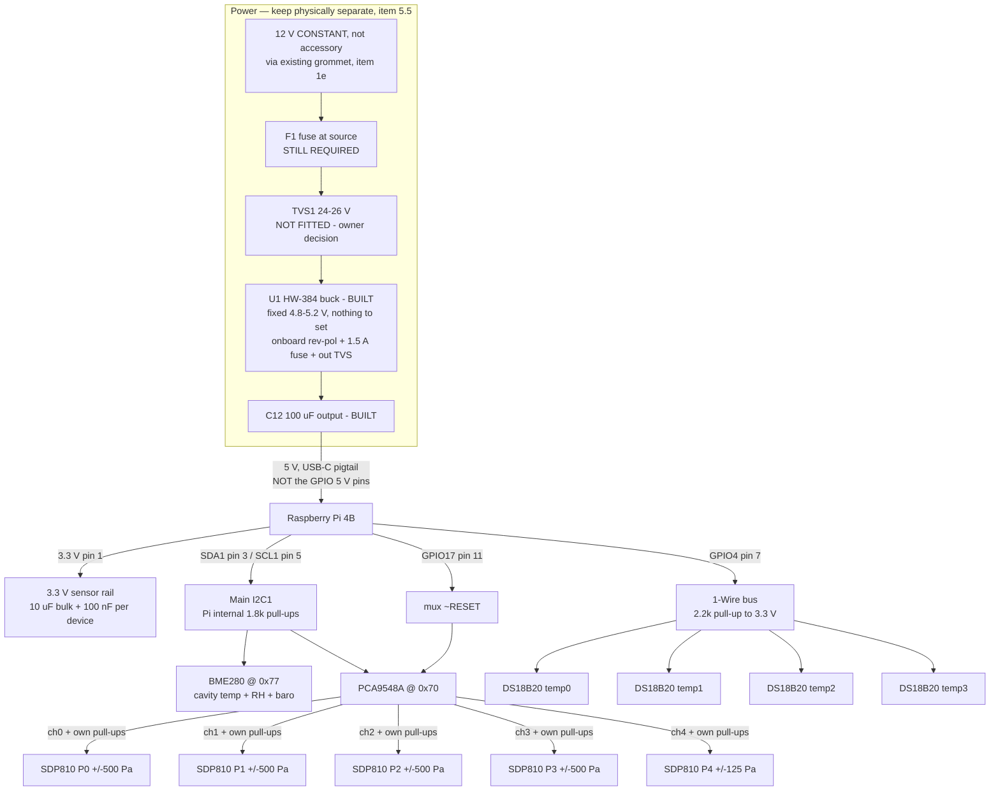
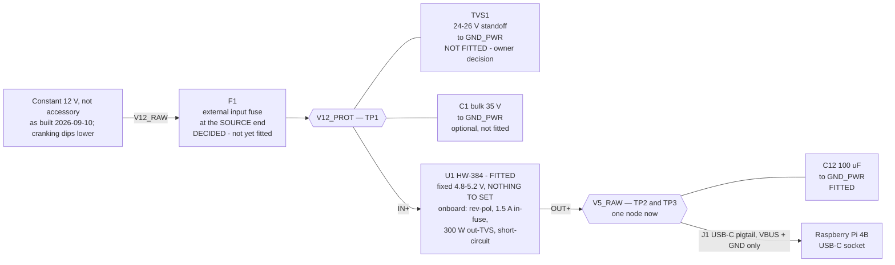
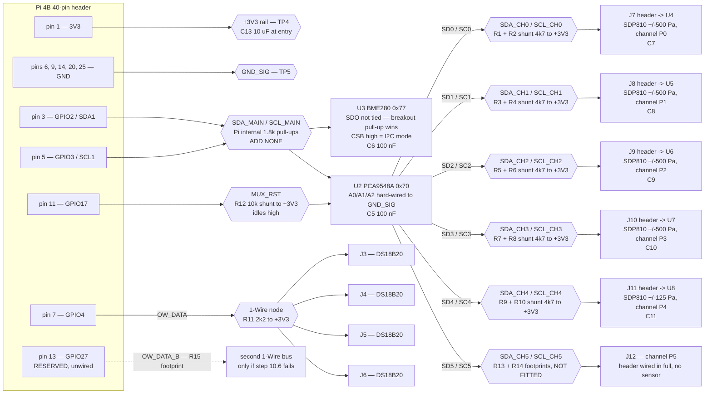

# Step 0b logger — perfboard wiring

**Companion to `../../ndLouvers/CFD-Learning-Plan.md` Step 0b.** The plan owns the requirements; this file is
the build sheet for the box-2 perfboard. Where the two disagree, **the plan wins** — bring the
disagreement back to the plan rather than resolving it at the bench.

**Status: power zone built and powered; the Pi runs on it; nothing measured.** The supply is
soldered — an **HW-384 buck module** (`U1`) with its USB-A port removed and pins fitted, plus a
100 µF output electrolytic (`C12`) — per the owner, 2026-09-07, who judges it sufficient. It has
been **powered and it powers the Pi**. **No measurement has been taken anywhere on the board:**
§10 step 2 (dummy load) and step 3 (crank transient) were bypassed. Step 4 is **partly met**: the
Pi has been logged into and reports `throttled=0x0` at idle (2026-09-09), which is the Pi's own
opinion of its rail and not a meter on it — step 2 stands, and so does the warm full-load re-read.
**The sensor zone is now assembled** (owner, 2026-09-09), and **the five SDP810s were delivered
2026-09-17; the first is fitted to mux channel 0 and reads correctly** (2026-09-18 — §5 has its
product number and serial). Its first bus scan raised three things and **§2 owns all of them**:
the BME280 answers at `0x77`, which the owner has **accepted as the specified address**; the mux is
a **PCA9548A** rather than a TCA9548A, which is harmless; and the mux was **held in reset by a
mis-soldered `~RESET`**, since resoldered and answering at `0x70`. Figures marked *(verify)* are
from datasheets or general practice and must be confirmed against the parts in hand.
**Four mux channels are still empty and their pull-up pairs are not fitted — do not address them**
(§5's warning; it hangs the whole bus).

**The HW-384 replaced the MP1584 and absorbed most of the discrete protection chain** (plan
commissioning item 5): onboard reverse-polarity protection, a 1.5 A input fuse and a 300 W TVS on
the 5 V output retire `RP1`, `D2`, `F2`, `L1`, `C3` and `C4`, and the fixed 4.8–5.2 V output
retires the trim-pot procedure entirely. Three things are **not** retired: `F1` at the source end
(safety — the onboard fuse protects nothing upstream of itself; **an external input fuse will be
fitted**, owner 2026-09-07), `TVS1` against load dump (the module states no absolute-maximum
input, and the owner has accepted that exposure), and every measurement in §10 steps 2–4 — which
were bypassed, not passed.

---

## 1. Why the mux exists — read this before laying anything out

**All five SDP810s share one fixed I2C address.** SDP800/SDP810 parts answer at `0x25`
(SDP801/SDP811 at `0x26`) — *(verify at boot; Step 0b commissioning item 2 already requires
reading product/revision/serial, which confirms it)*. They are not strappable. Five identical
addresses on one bus is an unresolvable collision, and **that is the entire reason the
TCA9548A is in the parts list.** It was never recorded in the plan; it is recorded here.

Two consequences that drive the whole layout:

1. **Exactly one SDP810 per mux channel.** Never two, whatever the channel count suggests.
2. **The TCA9548A does not pass pull-ups downstream.** Each channel is an electrically separate
   I2C segment. Every populated channel needs **its own SDA/SCL pull-up pair**. This is the most
   commonly missed part of a mux build and it fails in a confusing way — the bus works with one
   channel open and misbehaves as you switch.

**The BME280 does not go through the mux.** It has a unique address, so it hangs directly on the
Pi's main bus and saves a channel. It was to be strapped to `0x76` so it could never collide with a
mux strapped up from its default; **as built it answers at `0x77`, and the owner has accepted that
as the address** (§2 note 1). The collision the old rule guarded against cannot happen in this
build, because `A0`/`A1`/`A2` are grounded and the mux is at `0x70` alone — but it does mean
**`0x77` is no longer free, so never strap a mux upward on this board.**

---

## 2. Address map

| Device | Address | Bus | Note |
|---|---|---|---|
| PCA9548A mux (see note 4) | `0x70` | Pi main I2C1 | Default, A0/A1/A2 all low — confirmed grounded on the built board. Leave them low. **Answers since the `~RESET` resolder — note 2.** |
| BME280 | **`0x77`** | Pi main I2C1 | **Amended 2026-09-09 (owner): the specified `0x76` is superseded by the address the board answers on.** `SDO` is not held at `GND_SIG`; the breakout's own pull-up wins. See note 1. |
| SDP810 ×5 | `0x25` each | One per mux channel | Identical by design; isolated by the mux *(verify)* |
| DS18B20 ×4 | 64-bit ROM ID | 1-Wire, GPIO4 | Addressed by ROM ID, not I2C. ROM ID → `temp0`–`temp3` fixed at build (§5a); channel → role is a per-session record. |

**Measured on the assembled board, 2026-09-09, and re-measured 2026-09-10.** The first scan
returned exactly one device, `0x77`; with the mux's `~RESET` resoldered, `i2cdetect -y 1` now
returns **both `0x70` and `0x77`**, which is note 2's stated acceptance. Four notes; note 3 is an
open hardware question and note 2 is now closed.

1. **The BME280 is at `0x77`, and `0x77` is now the specified address** (owner decision,
   2026-09-09). It is a genuine BME280 and not a mux at a strapped address — chip-ID register
   `0xD0` reads `0x60`, which is the BME280 signature (`0x58` would be a BMP280). `U3.SDO` is
   therefore not being held at `GND_SIG` as net list row 9 required; the cause is an onboard
   pull-up on the breakout winning against the intended tie. **The owner has amended the document
   rather than the board**, so the table above and net list row 9 now read `0x77`, and the old
   "**Do not use `0x77`**" instruction is retired. **No collision results**, because the mux is
   strapped to `0x70` alone and the "keep `0x77` clear of the mux range" reasoning only bites if a
   mux is ever strapped upward, which this build does not do.
2. **The mux was held in reset by a mis-soldered `~RESET` pin — CAUSE FOUND, FIX IN PROGRESS**
   (owner, 2026-09-09). Nothing answered at `0x70`. The part is soldered and powered (3.3 V
   between `VIN` and `GND`, `SDA`/`SCL` correct, `A0`/`A1`/`A2` grounded), and `~RESET` measured
   **LOW at the mux**, which holds a PCA9548A in reset and makes it ignore the bus entirely.
   **The Pi end was provably correct throughout:** `gpio=17=op,dh` is live in
   `/boot/firmware/config.txt` and `pinctrl get 17` read **`17: op -- pd | hi`** — output, level
   high. So GPIO17 was driving `MUX_RST` high while the mux end read low, which localised the
   fault to net list row 12. **The owner found it: `~RESET` was soldered to header pin 9 instead
   of pin 11.** Being resoldered to **physical pin 11** (= GPIO17, net list row 12).
   **Pin 9 and pin 11 are adjacent in the same odd-numbered row, and pin 9 is a `GND_SIG` pin**
   (net list row 9 lists `PI1.9`). So this is a one-position off-by-one that lands `~RESET`
   directly on ground — the worst possible neighbour, because a PCA9548A held in reset does not
   misbehave or partially work: it goes completely silent, which reads exactly like an absent or
   dead part.
   **No pad stress resulted, contrary to what a short to a driven pin would imply.** GPIO17 was
   never connected to the `~RESET` net, so it drove high into an open circuit rather than into the
   short; the only current path was `R12`'s 10 kΩ from `+3V3` down to the mis-soldered ground,
   which is 0.33 mA and harmless. **Acceptance once it is back: `i2cdetect -y 1` shows `0x70`
   alongside `0x77`.**
   **Note for anyone re-measuring this net:** two of §3a.7's three `MUX_RST` checks catch this
   fault and one does not. Continuity pin 11 ↔ mux `RST` reads **open** (the real symptom) and
   `RST` ↔ `GND` reads a **dead short** (the cause), but `RST` ↔ `+3V3` still measures ~10 kΩ
   through `R12` and **passes**, so that row alone would have cleared a faulty board. Also, GPIO17
   only goes high once the firmware has read `config.txt`, so any reading taken with the Pi off or
   mid-boot reads low legitimately and means nothing.
3. **THE FIRST TRANSFER AFTER AN IDLE BUS IS REFUSED — ON SOME BOOTS, AND THIS IS UNQUALIFIED
   HARDWARE** (measured 2026-09-10 against the BME280 at `0x77`; **scope corrected 2026-09-18**).
   With an idle gap of 10 ms or more the
   first `I2C_RDWR` fails every time with `EREMOTEIO`; a second attempt 500 µs later succeeded
   60 of 60 across gaps of 50, 200 and 1000 ms. Back to back at 2 ms the first attempt mostly
   works. **`i2cdetect` and a shell loop of `i2ctransfer` do not show it**, because they issue
   transfers milliseconds apart and stay inside the warm window — so a clean `i2cdetect` beside a
   program that fails 100 % of the time is not a contradiction, and it is not a software bug.
   `i2ctransfer -y 1 w1@0x77 0xd0 r1`, run several times, is the check.
   **It does not happen on every boot, and that is the sharpest fact about it.** Reading
   `i2cFirstAttemptFailures` across all 32 sessions on the card (2026-09-18): most show **exactly
   one failure per sample cycle**, and **eight show exactly zero** — including the 38-hour two-day
   track session, 0 in 135 146 cycles. A bench sweep the same day found 0 refusals in 300 BME280
   reads and 150 SDP810 reads at gaps of 2–1000 ms. **So the behaviour is latched at
   initialisation and is either on or off for the life of a boot.** Two consequences: **a clean run
   proves nothing about the board**, only about that boot; and any future diagnosis must record
   which mode the boot was in before comparing anything.
   **The cause is not established.** `SDA_MAIN` and `SCL_MAIN` carry **no added pull-up**
   (net list rows 10 and 11); the bus relies on the Pi's own and on whatever the BME280 breakout
   fits, and that breakout's onboard pull-up is already known to have overridden the `SDO` tie
   (note 1). A rise-time or level-shifter explanation is plausible and unmeasured — **measure it
   before adding a resistor.** `../../ndLouvers/CFD-Learning-Plan.md` open item 44 owns the
   question.
   **The logger works around it in `i2cBus.cxx` with a counted ten-attempt retry**, which is what
   makes a 1 Hz sampler work at all, since at 1 Hz every cycle starts with an idle bus. **The
   retry is not the answer to the physical question.** Two consequences for this board:
   the five SDP810s sit on the same `SDA_MAIN`/`SCL_MAIN` through the mux and will meet the same
   behaviour; and §10's bring-up steps must not read a single failed transfer as an absent part.
4. **The part is a PCA9548A, not a TCA9548A** (owner, 2026-09-09 — the board is marked PCA9548A).
   **Harmless, and no line of this document changes because of it.** NXP's PCA9548A and TI's
   TCA9548A are functional equivalents for everything this build uses: same pinout, same
   `0x70`–`0x77` address range set by `A0`/`A1`/`A2`, same single-control-byte channel register,
   same **active-LOW** `~RESET` requiring a tie or pull-up to `+3V3`, and a supply range that
   covers 3.3 V on both. The naming is recorded so that a future reader searching the board for a
   "TCA9548A" does not conclude the wrong part was fitted. It also means note 2's reset behaviour
   is the same on either part.

---

## 3. Block diagram

This is the shape of the thing. **§3a is the wiring** — pin-level diagrams, the authoritative
net list and the pre-power checks — and §4 is a subset of it for the Pi header alone.

---

## 3a. Detailed wiring diagram

**The net list in §3a.4 is the authority, and it is now the only one.** The Mermaid diagrams
below and §4's header table are views of it. Where a picture and the net list disagree, the net
list is right and the picture is a bug — fix it. Designators (`F1`, `U1`, `R7` …) are used here,
on the board and on the enclosure label, so a fault can be named the same way in all three places.

**This section asserts topology, not part numbers.** Every value is *(verify)* against the parts
actually in hand, per the status note at the top of this file.

**There is no CAD schematic.** A KiCad project existed from rev 57 and was **deleted at rev 63**
by owner decision, once the rev-63 power-zone rebuild had made it stale and the board was built
and running: a hand-maintained second copy of this net list bought drift risk and nothing else.
Last present in commit `f5c2fea`, recoverable from git if it is ever wanted. Do not recreate one
without deciding first which copy is authoritative — that ambiguity is what made the old one a
liability.

### 3a.1 Designators

| Ref | Part | Zone |
|---|---|---|
| `J2` | 12 V input, 2-pin polarised, from the cabin feed (item 1e) | Power |
| `F1` | Fuse + holder, **at the source end**, sized to the feed — **decided and outstanding**: an external input fuse will be fitted (owner, 2026-09-07). The module's onboard 1.5 A fuse protects nothing upstream of itself | Power (in cabin) |
| `RP1` | **Retired** — reverse-polarity protection is onboard `U1` | — |
| `TVS1` | Transient clamp, ~24–26 V standoff — **not fitted, owner decision** (§3a.5 item 8) | Power |
| `C1` | Input bulk electrolytic, ≥35 V rated — **optional, not fitted**, pairs with `TVS1` | Power |
| `C2` | **Retired** — `U1` carries its own input decoupling | — |
| `U1` | **HW-384 buck module — FITTED.** USB-A port removed, pins soldered in. Fixed 4.8–5.2 V ±0.5 %, 6–24 V in, 3 A max, 500 kHz. Onboard: reverse-polarity, 1.5 A input fuse, 300 W output TVS, output short-circuit protection | Power |
| `F2` | **Retired** — `U1`'s onboard 1.5 A input fuse is the fusible element (§3a.5 item 8) | — |
| `D2` | **Retired** — `U1`'s onboard 300 W output TVS is the clamp (§3a.5 item 8) | — |
| `L1` | **Retired** — `U1` specifies ~10 mV ripple; `C12` provides the bulk | — |
| `C3` | **Retired** — superseded by `C12` | — |
| `C4` | **Retired** — see `C3` | — |
| `C12` | **100 µF output electrolytic — FITTED.** The owner's addition at `U1`'s output; the sole output bulk | Power |
| `J1` | USB-C power pigtail to the Pi — **confirmed in use** (owner, 2026-09-07); the GPIO 5 V pins are not in the path (§3a.5 item 7, plan item 5.4) | Power |
| `PI1` | Raspberry Pi 4B — the 40-pin header and the USB-C inlet | — |
| `U2` | **PCA9548A** mux `0x70` — board marked PCA9548A, a functional equivalent of the TCA9548A the parts list names (§2 note 4) | Sensor |
| `U3` | BME280 `0x77` | Sensor |
| `U4`–`U7` | SDP810 ±500 Pa — the sensors that plug into `J7`–`J10`, channels **P0–P3** | Off-board |
| `U8` | SDP810 **±125 Pa** — plugs into `J11`, channel **P4** | Off-board |
| `R1`–`R10` | 4.7 kΩ channel pull-ups, one pair per populated mux channel | Sensor |
| `R11` | 2.2 kΩ 1-Wire pull-up | Sensor |
| `R12` | 10 kΩ mux `~RESET` pull-up | Sensor |
| `R13`/`R14` | 4.7 kΩ pair for channel **P5** — **footprints only, not fitted** (§3a.6) | Sensor |
| `R15` | 2.2 kΩ pull-up for the reserved second 1-Wire bus — **footprint only** | Sensor |
| `C5`–`C11` | 100 nF local decoupling: `U2`, `U3`, `U4`–`U8` | Sensor |
| `C13` | 10 µF rail bulk at the 3.3 V entry | Sensor |
| `J3`–`J6` | 3-pin DS18B20 probe headers, one per probe | Sensor |
| `J7`–`J11` | 4-pin SDP810 headers, P0–P4 | Sensor |
| `J12` | 4-pin SDP810 header, P5, unpopulated | Sensor |
| `TP1`–`TP5` | Test points: `V12_PROT`, `V5_RAW`, `V5_RAW` again (`TP3` — `V5_FILT` is retired, §3a.4 row 7), `+3V3`, `GND` | Both |

`TP1`–`TP3` are not garnish: §10 steps 2 and 3 qualify the supply into a dummy load and through a
crank event before the Pi exists on this board, and they are where the meter goes.

### 3a.2 Power chain

**Hexagons are nets, rectangles are parts.** A part drawn hanging off a net by a plain line
(`TVS1`, `C1`, `C12`) sits between that net and `GND_PWR`; only the arrowed
path carries current through to the next stage. `GND_PWR` is the return for everything here,
`J1`'s ground conductor included.

**`TP2` and `TP3` are now the same node, and that node is `V5_RAW`.** With `F2`, `D2` and `L1`
retired there is nothing between the module output and the output bulk, so the old `V5_CLAMP` and
`V5_FILT` nets are gone (§3a.4 rows 6 and 7) and `V5_RAW` runs straight to `J1`. Keep both test
points if the board already has them — they are cheap — but do not expect a difference between
them, and do not read a difference as a fault.

### 3a.3 Signal chain

**Hexagons are nets, rectangles are parts** — the same convention as §3a.2. A pull-up named on a
net hangs from that net to `+3V3`; it is not in series with the bus. `+3V3` and `GND_SIG` are
drawn only as far as their rail nodes, because every device sits on both and net-list rows 8 and
9 say exactly who.

**`J3`–`J6` are four identical positions, not four channels.** A DS18B20's channel is its ROM ID
(§5a); which header a probe is plugged into means nothing and may change. `J7`–`J11` are the
opposite case — those *are* the channels, because a mux port is a physical address.

### 3a.4 Net list — authoritative

Notation is `REF.pin`. A net is complete as listed; anything not listed is not connected.

**The net list names board nodes only.** The five SDP810s and the four DS18B20s are off-board
parts that plug into `J7`–`J11` and `J3`–`J6`, so a sensor's supply pin appears here as its
header's pin, once — `U4`–`U8` are named in §3a.1 to identify the sensors, not as separately
wired nodes.

| # | Net | Nodes | Notes |
|---|---|---|---|
| 1 | `V12_RAW` | `J2.+12V`, `F1.a` | 2-core from the cabin, item 1e. `F1` is an **external input fuse, decided but not yet fitted** — until it is, `J2.+12V` runs straight to row 3 |
| 2 | `V12_FUSED` | **Retired** | `RP1` is onboard `U1`, so no node remains between `F1` and `U1.IN+`. Merged into row 3 |
| 3 | `V12_PROT` | `F1.b`, `TVS1.a`, `C1.+`, `U1.IN+`, `TP1.1` | **`TVS1` and `C1` are not fitted** (§3a.5 item 8). As built this net is `J2.+12V` → `U1.IN+` plus `TP1` |
| 4 | `GND_PWR` | `J2.GND`, `TVS1.k`, `C1.-`, `U1.IN-`, `U1.OUT-`, `C12.-`, `J1.GND` | Power-zone pour |
| 5 | `V5_RAW` | `U1.OUT+`, `C12.+`, `J1.VBUS`, `TP2.1`, `TP3.1` | **The whole output side is one node now.** `U1`'s output is fixed, so there is no pot to set — the meter still goes here, to *record* the output against the Pi's 4.63 V flag (plan item 5.4) |
| 6 | `V5_CLAMP` | **Retired** | `F2` and `D2` are onboard `U1` (§3a.5 item 8) |
| 7 | `V5_FILT` | **Retired** | `L1`/`C3`/`C4` retired; merged into row 5, so `TP3` reads the same node as `TP2` |
| 8 | `+3V3` | `PI1.1`, `C13.+`, `C5.1`, `C6.1`, `C7.1`, `C8.1`, `C9.1`, `C10.1`, `C11.1`, `U2.VCC`, `U3.VIN`, `U3.CSB`, `J7.VDD`, `J8.VDD`, `J9.VDD`, `J10.VDD`, `J11.VDD`, `J12.VDD`, `J3.VDD`, `J4.VDD`, `J5.VDD`, `J6.VDD`, `R1.a`, `R2.a`, `R3.a`, `R4.a`, `R5.a`, `R6.a`, `R7.a`, `R8.a`, `R9.a`, `R10.a`, `R11.a`, `R12.a`, `R13.a`, `R14.a`, `R15.a`, `TP4.1` | Sensor rail |
| 9 | `GND_SIG` | `PI1.6`, `PI1.9`, `PI1.14`, `PI1.20`, `PI1.25`, `C13.-`, `C5.2`, `C6.2`, `C7.2`, `C8.2`, `C9.2`, `C10.2`, `C11.2`, `U2.GND`, `U2.A0`, `U2.A1`, `U2.A2`, `U3.GND`, ~~`U3.SDO`~~, `J7.GND`, `J8.GND`, `J9.GND`, `J10.GND`, `J11.GND`, `J12.GND`, `J3.GND`, `J4.GND`, `J5.GND`, `J6.GND`, `TP5.1` | Sensor-zone pour. **`U3.SDO` struck out 2026-09-09**: as built the BME280 answers at `0x77`, so `SDO` is not on this net and the owner has accepted the address rather than the tie (§2 note 1). |
| 10 | `SDA_MAIN` | `PI1.3`, `U2.SDA`, `U3.SDA` | No added pull-up |
| 11 | `SCL_MAIN` | `PI1.5`, `U2.SCL`, `U3.SCL` | No added pull-up |
| 12 | `MUX_RST` | `PI1.11`, `U2.~RESET`, `R12.b` | `R12.a` to `+3V3` |
| 13 | `OW_DATA` | `PI1.7`, `R11.b`, `J3.DQ`, `J4.DQ`, `J5.DQ`, `J6.DQ` | `R11.a` to `+3V3`; star, not daisy chain |
| 14 | `SDA_CH0` | `U2.SD0`, `R1.b`, `J7.SDA` | `R1.a` to `+3V3` |
| 15 | `SCL_CH0` | `U2.SC0`, `R2.b`, `J7.SCL` | `R2.a` to `+3V3` |
| 16 | `SDA_CH1` | `U2.SD1`, `R3.b`, `J8.SDA` | |
| 17 | `SCL_CH1` | `U2.SC1`, `R4.b`, `J8.SCL` | |
| 18 | `SDA_CH2` | `U2.SD2`, `R5.b`, `J9.SDA` | |
| 19 | `SCL_CH2` | `U2.SC2`, `R6.b`, `J9.SCL` | |
| 20 | `SDA_CH3` | `U2.SD3`, `R7.b`, `J10.SDA` | |
| 21 | `SCL_CH3` | `U2.SC3`, `R8.b`, `J10.SCL` | |
| 22 | `SDA_CH4` | `U2.SD4`, `R9.b`, `J11.SDA` | `J11` is the ±125 Pa position |
| 23 | `SCL_CH4` | `U2.SC4`, `R10.b`, `J11.SCL` | |
| 24 | `SDA_CH5` | `U2.SD5`, `J12.SDA`, `R13.b` *(footprint)* | Reserved — §3a.6 |
| 25 | `SCL_CH5` | `U2.SC5`, `J12.SCL`, `R14.b` *(footprint)* | Reserved — §3a.6 |
| 26 | `OW_DATA_B` | `PI1.13`, `R15.b` *(footprint)* | Track to `GPIO27` is laid; `R15` is not fitted. Contingency for step 10.6 |

**`U2.SD6/SC6` and `SD7/SC7` are left open.** Unused mux channels are not a hazard, but do not tie
them anywhere — a grounded channel makes a switching fault look like a bus fault.

**`GND_PWR` and `GND_SIG` are two pours, joined in exactly one place: through `J1`'s ground
conductor, inside the Pi.** Do not add a board-level link between them. That is what keeps the
buck's switching return current out of the copper the I2C and 1-Wire returns use, which is plan
item 5.5's whole concern. There is no floating-rail hazard in this arrangement, because `J1` is
also the Pi's only supply — lose that conductor and the board is dead, not half-powered.

**3.3 V current budget** *(verify against the datasheets once the parts are in hand)*: five
SDP810s at ~6 mA, four DS18B20s at ~1.5 mA active, mux and BME280 under 1 mA each — call it
**~50 mA**, comfortably inside what Pi pin 1 will give. If the measured figure lands far from
this, something is wired wrong; do not simply accept it.

### 3a.5 Device pinouts, and the connectors that will bite

1. **SDP810 pin order is deliberately not asserted here.** These are the most expensive parts on
   the board and the only ones that cannot be replaced from stock. Take pin 1 from the datasheet
   drawing *and* from the pin-1 marker on the parts in hand, write the mapping into this section
   when the sensors arrive, and only then cut headers. The nets they join are already fixed
   (rows 14–23); which physical pin carries which is not yet knowable here.
2. **BME280 breakout supply.** Some breakouts (`VIN` + onboard regulator + level shifters) expect
   5 V and brown out on 3.3 V; bare `GY-BME280`-style modules take 3.3 V directly. **Establish
   which one is on hand before it goes on the rail** *(verify)*. This board has no 5 V anywhere
   in the sensor zone by design, so a regulator-type breakout must be fed at its 3.3 V node, not
   at `VIN`.
3. **BME280 `CSB` must be high** for I2C mode. Most breakouts tie it up on-board; if this one does
   not, `CSB` goes to `+3V3` (row 8). **`SDO` is not tied on this board** — the breakout's own
   pull-up wins and the part answers at `0x77`, which §2 note 1 records as the specified address.
4. **DS18B20 cable colours vary by vendor** — red/black/yellow is common, red/green/yellow and
   red/blue/yellow both exist, and a sealed probe cannot be rung out to the TO-92 pins. Reversed
   `VDD`/`GND` destroys the probe. This is why §10 step 6 brings the probes up **one at a time**:
   a mis-coloured cable then costs one probe instead of four.
5. **Optional 1-Wire series resistors.** If step 10.6 produces CRC errors rather than outright
   non-enumeration, ~100 Ω in series with each probe's `DQ` at its header usually settles the
   reflections a 4 × 5 m star produces. Not fitted at build — reach for it *before* splitting the
   bus to `GPIO27`, since it costs one resistor rather than a second bus.
6. **`GPIO17` boots as an input with the SoC's default pull-down (~50 kΩ).** Against `R12` at
   10 kΩ the `~RESET` node idles near 2.7 V — above V_IH, but not by much *(verify at the
   bench)*. Drive `GPIO17` high in firmware before the first mux transaction, and drop `R12` to
   4.7 kΩ if the boot-time level measures marginal. `GPIO4` has the opposite default — an
   internal pull-up — which is harmless alongside `R11`.
7. **`J1`, the USB-C pigtail, carries `VBUS` and `GND` only.** `CC1`/`CC2` are the pigtail's
   business, not this board's: a dumb 5 V source needs no negotiation for the Pi to accept power
   *(verify on the pigtail actually bought)*. **A pigtail is confirmed in use** (owner,
   2026-09-07), so the GPIO 5 V pins are not in the path — and with a fixed-output module the
   pigtail's own drop is the only part of the rail margin left to adjust (§3a.5 item 9).
8. **The crowbar is now inside `U1`, and the remaining gap is on the input side.** The old
   `D2` + `F2` pair existed because a TVS across a supply stuck at 12 V conducts until something
   opens the circuit. The HW-384 supplies both halves: a 300 W TVS on the 5 V output and a 1.5 A
   fuse on the input, which is what opens. That the fuse sits on the *input* side is fine for
   this fault — a shorted pass element draws the clearing current through it — but it means the
   fuse rating is an input-current rating, so do not reason about it as though it were in series
   with the 5 V load.

   **What the module does not provide is input transient protection.** The vendor gives a 24 V
   nominal input ceiling and **no absolute-maximum figure**, and a 12 V system's load dump goes
   above 24 V. `TVS1` (~24–26 V standoff, e.g. SMBJ24A or P6KE24A), optionally with `C1`, is the
   one part still worth adding; it is a single component across `V12_PROT` and `GND_PWR`. The
   owner has accepted the supply as built without it, so this is recorded as **exposure, not a
   blocker** — plan item 5.1 owns the decision.

   **`F1` is a different argument and it is not optional — and it is settled.** The onboard fuse
   protects everything downstream of itself and nothing upstream, so the whole run from the tap
   to the wheel-well cavity would be unfused. That is a fire risk in a car, not a hardware-loss
   risk, which is why it was never negotiable. **An external input fuse will be fitted** (owner,
   2026-09-07); it is an outstanding part, not an open question (plan item 5.2).
9. **Wire sizes.** `V12_RAW` from the cabin and the `J1` pigtail carry the whole logger current —
   0.5 mm² / 20 AWG minimum, and the pigtail is the one to be fussy about. **This matters more
   now, not less:** the old 5.1 V trim existed to cover pigtail drop, and a fixed-output module
   cannot be trimmed up, so every millivolt lost in the pigtail comes straight off the margin to
   the Pi's 4.63 V undervoltage flag (plan item 5.4). Signal nets are unloaded and any wire
   will do; spend the effort on keeping the five channel pairs short instead (§6).

### 3a.6 Channel P5 is wired but not populated

§5 reserves P5 as a sixth position; §6 specifies pull-ups on **five** channels. Both are right,
and this is where they meet: **`J12` is wired in full at build** — `SD5`/`SC5` from the mux,
`+3V3` and `GND_SIG` to its supply pins — and `R13`/`R14` get footprints but **no resistors**.
Fit the pair with the sensor, never before.

Wiring the reserved header's supply pins is the point of reserving it. A `J12` with signal but
no rail would need the board opened again to add two wires, which is exactly the rework the
reserved position exists to avoid. `R15` and the `GPIO27` track are reserved the same way
(row 26): the copper is there, the part is not.

An unpopulated channel carrying pull-ups is electrically harmless — the mux isolates it — but it
makes the §10 step 7 isolation test read as though a channel were present, and that test is the
one diagnostic this whole build depends on.

### 3a.7 Pre-power checks

**The power-zone rows are retrospective now** — the supply was powered without them (§10 step 1),
so they can no longer be a gate; run them if the board comes apart again. The sensor-zone rows
still apply in full, because that zone is not built.

Power off, nothing connected to `J2`, meter on resistance. In-circuit readings are pulled about by
parallel paths, so treat these as **orders of magnitude, not measurements**. This is a wiring
check only; §7 and §10 own the destroy-hardware checks and the bring-up order.

**Two rows disagree about whether the Pi is mated, so take them in this order.** Do the
`GND_PWR ↔ GND_SIG` row first with the Pi and the pigtail both **disconnected** — mated, the Pi
joins those two pours legitimately and the check reads as a short whether or not a second tie
exists. Do the `SDA_MAIN ↔ +3V3` row with the header **mated but unpowered**, because the 1.8 kΩ
being looked for lives inside the Pi. Everything else reads on the bare board.

| Between | Expect | What a failure means |
|---|---|---|
| `V12_PROT` ↔ `GND_PWR` | High; drifting up only if `C1` is fitted | `TVS1` backwards (if fitted), or a short under the module |
| `V5_RAW` ↔ `GND_PWR` | High, drifting up as `C12` charges off the meter | `C12` backwards, or a solder bridge under `U1` |
| `+3V3` ↔ `GND_SIG` | > 1 kΩ | A sensor or a decoupling cap is in backwards |
| `+3V3` ↔ `V5_RAW` | Open | The two voltage domains have met. Find it before power |
| `GND_PWR` ↔ `GND_SIG` | **Open on the board** | A second ground tie exists — remove it (§3a.4) |
| `SDA_MAIN` ↔ `+3V3` | ~1.8 kΩ, lower if breakout pull-ups remain | Confirms §6's Pi-side pull-ups and that the breakouts' were dealt with |
| `SDA_CHn` ↔ `+3V3` | ~4.7 kΩ, on each of the five | **The commonest fault in a mux build** — a missing channel pair |
| `OW_DATA` ↔ `+3V3` | ~2.2 kΩ | `R11` missing or the wrong value |
| `MUX_RST` ↔ `+3V3` | ~10 kΩ | `R12` missing — the mux may boot held in reset. **This row is not sufficient on its own** — it passed on a board whose `~RESET` was soldered to ground (§2 note 2), because `R12` is measured from the net regardless of what else the net touches |
| `MUX_RST` ↔ `GND_SIG` | **High** | `~RESET` is shorted to ground and the mux will be held in reset and completely silent. **This is a fault that has actually happened on this board** — pin 9 instead of pin 11, §2 note 2 |
| `MUX_RST` ↔ `PI1.11` | **Short, a few Ω** | The `MUX_RST` wire is open or on the wrong header pin. Pin 9 is its adjacent neighbour and is ground |
| `SDA_CH5` ↔ `+3V3` | **Open** | `R13`/`R14` were fitted early (§3a.6) |

---

## 4. Pi 4B header connections

**The header seen from the Pi's side. §3a.4 is the full net list; this table adds nothing to it
and must not disagree with it.**

| Pi pin | Signal | Goes to |
|---|---|---|
| 1 | 3.3 V | Sensor rail — mux VCC, BME280 VCC, all five SDP810 VDD, all four DS18B20 VDD |
| 3 | GPIO2 / SDA1 | Mux `SDA`, BME280 `SDA` |
| 5 | GPIO3 / SCL1 | Mux `SCL`, BME280 `SCL` |
| 6 | GND | Board ground plane / rail |
| 7 | GPIO4 | 1-Wire data, all four DS18B20 |
| 9 | GND | Second ground tie |
| 11 | GPIO17 | Mux `~RESET` |
| 13 | GPIO27 | **Reserved and unwired** — second 1-Wire bus only if §10 step 6 fails. `R15` footprint, §3a.4 row 26 |
| 14, 20, 25 | GND | Ground ties for the sensor and 1-Wire returns |
| USB-C | 5 V in | From the buck's clamped output. **Not** pins 2/4. |

**Pins 2 and 4 (5 V) stay unconnected.** Plan commissioning item 5.4: feeding the GPIO 5 V pins
bypasses the Pi's own input protection. A USB-C pigtail is the specified path. A dumb 5 V source
needs no CC negotiation for the Pi to accept power *(verify on your pigtail)*.

---

## 5. Mux channel allocation

**Channel names are positional and carry no test-scenario meaning.** A logger channel is a piece
of hardware — one mux port, one sensor with a serial and a fixed range, two tube tails — so it is
named for where it sits: **P0 … P5**. Which measurement a channel serves is a property of the
*session*, not of the board. The plan's role letters already move between phases (Step 0b phase B
reassigns sensors across roles), so a role frozen into a channel name would leave every later
scheme translating its roles through an obsolete one, and would make a wiring fault and a
mapping fault look alike.

**The P→role mapping is deliberately not decided here.** Fix it when the testing scheme is
final, record it per session in that session's file, and log it at boot alongside the sensor
serials (plan commissioning item 2). Reassigning a channel is then a tube move plus one line in
the session mapping — never a relabelled board.

| Mux ch | Channel | Sensor fitted | Product / serial, as read | Tube tails |
|---|---|---|---|---|
| SD0/SC0 | **P0** | SDP810 ±500 Pa — **FITTED 2026-09-18** | `0x03020A01` / **`0x000000009B994E22`** | `P0+` / `P0−` |
| SD1/SC1 | **P1** | SDP810 ±500 Pa — not fitted | record at build | `P1+` / `P1−` |
| SD2/SC2 | **P2** | SDP810 ±500 Pa — not fitted | record at build | `P2+` / `P2−` |
| SD3/SC3 | **P3** | SDP810 ±500 Pa — not fitted | record at build | `P3+` / `P3−` |
| SD4/SC4 | **P4** | SDP810 **±125 Pa** — not fitted; **connectorised, not soldered** | record at build | `P4+` / `P4−` |
| SD5/SC5 | **P5** | Unpopulated. Reserved position, wired for a sixth sensor. `R13`/`R14` are footprints only. | — | — |
| SD6–7 | — | Not used. Leave unpopulated. | | |

**Read the product number, do not trust the bag.** P0's was read back over I2C on 2026-09-18
(`0x367C`, `0xE102`, 18 bytes, CRC clean) and `0x03020A01` is the SDP810-500Pa signature;
`0x03020B01` would be the ±125 Pa part, which is the substitution this column exists to catch. The
sensor also returned its **60 counts/Pa** scale factor, matching the plan's nominal — read it and
retain it per sensor rather than hard-coding one, since the ±125 Pa part returns 240.

> **⚠ NEVER ADDRESS A MUX CHANNEL WHOSE PULL-UP PAIR IS NOT FITTED — IT HANGS THE WHOLE BUS.**
> Measured the hard way on 2026-09-18: with P0 working, a probe of **channel 1** (empty, `R3`/`R4`
> not yet fitted) NAK'd, and every subsequent transfer on the **main** bus then failed with
> `ETIMEDOUT` — the mux, the BME280, everything. `i2cdetect` still listed `0x70` and `0x77`, and
> `SDA`/`SCL` both measured idle-high, so nothing looked wrong. **A `~RESET` pulse on GPIO17
> recovered it** (`pinctrl set 17 op dl`, pause, `pinctrl set 17 op dh`). This is §1's "misbehaves
> as you switch" warning arriving in practice. Two rules follow: a bring-up scan must enumerate
> only channels whose resistors are in, and **the pressure worker must never sweep channels
> blindly** — it iterates a configured list of populated channels, and an unconfigured channel is
> never selected.

**Range belongs in this table because it is a hardware fact, not a scenario one.** Exactly one
±125 Pa part exists and it sits at P4. That constrains which roles P4 can serve without
unsoldering, and nothing else — if a later scheme wants the low range at another location, move
the *tubes*, not the sensor.

**`P` means a logger channel and nothing else.** The plan's two pitot probes were renamed
**T1/T2** at rev 54 for this reason; do not reintroduce `P1`/`P2` as probe names.

Label every sensor **and both of its tube tails** with the channel number and port sign as you
solder. The plan requires the port map in each session file; getting it wrong at the bench is
silent, and the pre/post comparison will not necessarily catch a swapped pair.

---

## 5a. Thermal channel allocation

Same rule as §5: **`temp0`–`temp3` are generic channel names and carry no location or scenario
meaning.** The plan's role names — T_ambient, T_core_in, T_core_out, T_aft — are measurement
quantities that appear in its formulas, not names for these four probes, and the role→channel
mapping is decided in the plan when the testing scheme is final, then recorded per session.

**A thermal channel is defined by its ROM ID, not by a position.** The four DS18B20s share one
1-Wire bus and are addressed by 64-bit ROM ID, so unlike the mux there is no physical slot to
name. The ROM ID → channel assignment is therefore the definition, made once and never changed.

**How the assignment is made has changed twice, and both supersessions are load-bearing here.**

1. **Not at the bench, and not by hand.** The owner plugs the probes into the *logger* one at a
   time, lowest channel first, with `KnurLogger --enroll` running; it binds each new `28-*` ROM ID
   to the next free channel and persists it to the `[thermal]` section of the `KnurLogger.ini`
   beside the binary, as `temp<N>RomId` (owner decision, 2026-09-09; worker written 2026-09-10;
   moved there from a separate `channels.ini` on 2026-09-10). It refuses a step in which two
   unbound probes appear at once, because sysfs order is not arrival order.
   **Every probe stays plugged in once it is in** — unplugging as you go binds correctly but never
   loads this star, which is the one thing the plan's thermal item 1 is waiting for.
   `../README.md` §Enrolling the four DS18B20s is the procedure; the plan's thermal
   item 1 is the requirement.
2. **Marking the probe bodies is moot.** The four are already installed on the car (owner,
   2026-09-09), and the owner identifies each lead at the logger end, so plugging in from a known
   location binds channel → location directly. If a lead is ever ambiguous, warm one probe by hand
   and watch which channel moves.

**Enrolled 2026-09-10 at the car, all four, from the session
`2026-09-10T11-24-01.841462Z-enroll.ndjson`.** The plug-in order is the installed order the plan
fixes, and the owner identified each lead at the logger end as it went in — which is what binds
channel → location, per plan thermal item 1.

| Channel | ROM ID | Cable | Plug-in order | Reading at bind |
|---|---|---|---|---|
| `temp0` | `28-06254385da1f` | 5 m | first | 21.94 °C |
| `temp1` | `28-0625424044b7` | 5 m | second | 21.75 °C |
| `temp2` | `28-062542ac86b6` | 5 m | third | 21.88 °C |
| `temp3` | `28-0625424e16c9` | 5 m | fourth | 21.75 °C |

**The channel → role map is independently confirmed** (2026-09-10): with all four bound, each probe
was warmed by hand in installed order and `temp0`, `temp1`, `temp2`, `temp3` rose in that order
with clean separation, +3.8 to +5.4 K each. That is the check the plan's thermal item 1 provides
for, and it rules out a swapped pair — which is the one error that would look like nothing in
every record.

**These four ROM IDs are the channel definitions.** They also live, as the live configuration, in
`temp0RomId`..`temp3RomId` in `../build/KnurLogger.ini` — this table is the human record and that
file is what the logger reads. If they ever disagree, the logger is right about what it is doing
and this table is wrong.

**An earlier attempt the same day bound three and was discarded**, and its order differed from this
one on the last two probes. Do not reconcile this table against it: the owner confirmed the order
above, and the discarded set is superseded. See `../CLAUDE.history.md` §1.11.

> **The bus qualified on the same run, and that was the point of it.** With all four connected,
> 63 consecutive cycles enumerated four probes with a valid-mask of 15 every time — **zero read
> errors, zero CRC failures, zero non-probe entries** — which is plan thermal item 1's first
> requirement, open since the ESP32 star run was deliberately skipped. §3a.5 item 5's fallbacks
> (series resistors, then splitting to GPIO27 as a second bus) are **not needed**: the 2.2 kΩ
> pull-up at `R11` carries the loaded 4 × 5 m star as built.

All four are electrically and mechanically identical, so any channel can serve any role — the
constraint that applies to P4's ±125 Pa range has no thermal equivalent.

---

## 6. Resistors and passives

| Where | Value | Why |
|---|---|---|
| Main I2C1 (SDA/SCL) | **none** | The Pi 4B already has fixed 1.8 kΩ pull-ups on GPIO2/3. Do not add more — they parallel down. Remove any fitted on the mux and BME280 breakouts, or confirm the combination. |
| Each mux channel ×5 — `R1`–`R10` | **4.7 kΩ ×2** to 3.3 V | Mandatory per §1. Short perfboard traces at 100 kHz. |
| 1-Wire data — `R11` | **2.2 kΩ** to 3.3 V | Stronger than the usual 4.7 kΩ: four sensors on ~20 m of cable in a star is a hard case for 1-Wire. |
| Mux `~RESET` — `R12` | 10 kΩ to 3.3 V | Idle high; GPIO17 drives it low to recover a wedged bus. Check the boot-time level: §3a.5 item 6. |
| Every IC — `C5`–`C11` | 100 nF | Local decoupling, at the pins. Seven devices: mux, BME280, five SDP810s. |
| Sensor rail — `C13` | 10 µF | Bulk, at the rail entry. |
| Channel P5 — `R13`/`R14` | 4.7 kΩ ×2 | **Footprints only, not fitted.** Fit with the sixth sensor, never before — §3a.6. |
| Second 1-Wire bus — `R15` | 2.2 kΩ | **Footprint only.** Contingency for §10 step 6. |
| Buck output — `C12` | **100 µF** electrolytic | **Fitted.** The owner's addition at `U1`'s output and the only output bulk, `L1`/`C3`/`C4` having been retired with the HW-384 (§3a.1). |

**Power-zone passives that no longer exist:** `C2` (input HF — onboard `U1`), `C3`/`C4` (output
filter — superseded by `C12`). `C1` remains specified but unfitted, as the optional partner to
`TVS1`. Do not re-add the retired parts from an older revision of this sheet.

**Run the I2C bus at 100 kHz.** Three reasons, and the throughput one is the weakest. The whole
rig samples at 10 Hz across five sensors — a few hundred bytes per second — so there is no
throughput argument for 400 kHz either way; and the slower edges are better behaved next to a
switching regulator. **The binding reason is rise time.** Each mux channel carries its own
4.7 kΩ pull-ups above, and t_rise ≈ 0.85·R·C against fast mode's 300 ns limit leaves only about
**75 pF** of segment capacitance — which a breakout plus its wiring can spend. Standard mode
allows 1000 ns, so the same pull-ups get about **250 pF**. Raising the speed therefore requires
either a measurement of the actual segment capacitance or lower pull-ups, and a change here
first; it is not a setting to try casually during bring-up.

*Host side:* `KnurLogger`'s `SystemSetup/harden-headless.sh` writes
`dtparam=i2c_arm=on,i2c_arm_baudrate=100000` into `config.txt` to implement this. An earlier draft
of that script wrote 400 kHz, copied from `iSitePiLogger`; corrected 2026-09-09 (history rev 66).

---

## 7. Two ways to destroy hardware — check both before first power

**Check 1 applies to every probe fitting, not only the first.** All four DS18B20s are now fitted
and enrolled, so it governs any swap or re-fit rather than a first power-on. **Check 2 was bypassed**; see
the note under it.

1. **DS18B20 supply voltage.** These parts accept 3.0–5.5 V, and the 1-Wire data line idles at
   whatever rail the pull-up goes to. **Supply them from 3.3 V and pull up to 3.3 V.** Powered at
   5 V, the data line presents 5 V to GPIO4, which is not 5 V tolerant. This kills the Pi.
2. **Measure the HW-384's output into a dummy load before it is connected to anything.** The
   module is **fixed-output, so there is no pot to set, mis-set or knock** — the failure mode this
   check was originally written for is gone, and it is *not* a reason to skip the check. Two
   things replace it. First, confirm the output is actually ~5 V and not something else: a
   stripped and re-pinned module can be mis-soldered, and the only way to find that out safely is
   into a dummy load with a meter at `TP2`. Second, **record the value** — the module cannot be
   trimmed up, the vendor band bottoms at 4.8 V, and the Pi 4B flags undervoltage near 4.63 V, so
   the margin against pigtail drop is a number you need rather than a number you assume (plan
   item 5.4). This is risk register 14, and §10 steps 2–4 are how it is discharged.

   **As built, this check was bypassed** (owner, 2026-09-07): the supply was powered and the Pi
   connected without it. The Pi survived, so the destructive outcome did not occur — but the
   measurement is still missing and is still the thing that tells you whether the rail has any
   margin. Take it in place, per §10 step 2.

Use parasitic-power mode for the DS18B20s under no circumstances: the plan specifies a *powered*
1-Wire arrangement. Three wires per probe, not two.

---

## 8. Physical layout on the board

Three zones, driven by plan items 5.5 and 1b:

1. **Power zone** — `J2`, `F1`'s cable, `U1` and `C12`, plus `TVS1`/`C1` if fitted.
   Put this at one end with its own ground pour, `GND_PWR`. **That pour's only tie to the sensor
   side is `J1`'s ground conductor, through the Pi** (§3a.4) — do not add a board-level link
   between the two pours. Item 5.4: the victims of buck noise are the I2C bus and the 1-Wire
   runs, not the radio.
2. **Sensor zone** — mux, BME280, the five SDP810 headers, all pull-ups, on the `GND_SIG` pour.
   As far from the power zone as the board allows.
3. **Antenna keep-out** — item 1b. The Pi 4B's PCB antenna is at the microSD/USB-C corner
   *(confirm on the board)*. Nothing metallic within 15–20 mm of it: no buck, no bulk caps, no
   mounting standoff, no cable bundle crossing over it. Orient the finished assembly so this
   corner faces the cavity's largest opening.

Keep the SDP810s grouped and their pneumatic tails exiting the same edge of the board — the
enclosure gland positions and the drainage requirement in item 1a both depend on where those
tails leave. **The sensors must sit above their traps** (item 1a): decide the board's mounting
orientation in the cavity *before* fixing tail positions, not after.

---

## 9. Bill of materials

**Fitted on the board** *(owner, 2026-09-07)*: `U1` HW-384 buck module, USB-A port removed and
pins soldered in; `C12` 100 µF output electrolytic. Not powered or measured.

**On hand** *(per the plan's inventory — verify condition)*: Pi 4B, microSD, BME280, PCA9548A,
4 × DS18B20 with 5 m cable. **MP1584 module — superseded by the HW-384, now an unused spare.**

**Delivered 2026-09-17**: 4 × SDP810-500Pa, 1 × SDP810-125Pa. **One ±500 Pa is fitted to mux
channel 0 and reads correctly** (2026-09-18, §5 has its serial); the other four are not fitted.
Fit `F1` and `TVS1` and bench the supply into a dummy load **before connecting them** (plan risk
14; §10 steps 2–3 were bypassed, not passed — and the channel-0 sensor went on ahead of them,
so that precondition is now bypassed for it too).

> **⚠ The single SDP810-125Pa must be CONNECTORISED, not hard-soldered** (plan open item 38,
> closed rev 67e). It is time-shared between two duties in different measurement phases —
> Step 11 item 1a's logged core-exit velocity probe, and rev 46's parallel high-resolution shadow
> channel on a Cp tap pair — because the owner declined to buy a sixth sensor and the plan
> reallocates sensors between phases rather than buying more. **It therefore has to be movable
> between mux channels and tube pairs without desoldering.** Specify this before the sensor zone
> is built; retrofitting it means unpicking a soldered joint on the one sensor that moves. Record
> per session which duty it was on and on which mux channel.

**Retired — do not buy, the HW-384 carries these onboard** (§3a.5 item 8): `RP1`
reverse-polarity, `D2` output clamp, `F2` clamp fuse, `L1`/`C3` output filter, `C2`/`C4` HF
decoupling.

**Still to obtain:**

| Item | Ref | For | Status |
|---|---|---|---|
| Fuse + holder, sized to the feed | `F1` | Source-side protection, item 5.2 | **Decided, outstanding.** An external input fuse will be fitted (owner, 2026-09-07) |
| TVS, ~24–26 V standoff (SMBJ24A / P6KE24A) | `TVS1` | Load-dump clamp, item 5.1 | **Owner decision.** The one gap the module leaves; accepted as exposure for now |
| Bulk input capacitance, ≥35 V | `C1` | Item 5.1 | Optional partner to `TVS1` |
| USB-C power pigtail | `J1` | Item 5.4 feed path | **In use** (owner, 2026-09-07) |
| Perfboard, headers, 3-core cable for probe runs | `J2`–`J12` | Assembly | |
| Resistors: 10 × 4.7 kΩ, 1 × 2.2 kΩ, 1 × 10 kΩ | `R1`–`R12` | §6 | |
| Spare resistors: 2 × 4.7 kΩ, 1 × 2.2 kΩ, 4 × ~100 Ω | `R13`–`R15`, 1-Wire series | Contingency stock, not fitted — §3a.5 items 5 and 6, §3a.6 | |
| Capacitors: 7 × 100 nF, 1 × 10 µF | `C5`–`C11`, `C13` | §6 — sensor zone only now | |
| Test-point pins or pads, 5 | `TP1`–`TP5` | §3a.7 and §10 steps 2–3 | |

---

## 10. Build and bring-up order

Do not deviate from this order. Risk register 14 is a single-supply-kills-everything risk, so
the supply is qualified alone, first, and the expensive parts go on last.

1. **Build the power zone only. DONE** *(owner, 2026-09-07)* — `U1` and `C12` are soldered; `F1`
   and `TVS1`/`C1` are outstanding per §9. The §3a.7 power rows were not run on the bare board;
   that opportunity has passed, since the board is now powered and populated.
2. **~~Measure the output into a dummy load~~ — BYPASSED** *(owner, 2026-09-07)*: the supply was
   powered and the Pi connected without it. **Still do the measurement**, now in place: meter at
   `TP2` under load, and again at the Pi's USB-C end. There is no pot to set — the HW-384 is
   fixed-output — so this is *verification and a number*: confirm ~5 V rather than a mis-solder,
   and **write the value down**, because it is the margin against the 4.63 V flag that a fixed
   module cannot be trimmed to fix (plan item 5.4). See §7 check 2.
3. **~~Transient-check the supply before it ever sees the Pi~~ — BYPASSED** *(owner,
   2026-09-07)*. Still worth running, and still looking for the same two things: the cranking dip
   that reboots a logger mid-session, and — because `TVS1` is not fitted — any sign that
   switch-off or load-dump transients reach the output (§3a.5 item 8). **Unplug the Pi and run it
   into a dummy load** if practical; that recovers most of what doing it in this order gave away.
4. **Add the Pi alone**, through `J1`. **Partly done** — the Pi is powered from the module, but
   there has been no login, so the acceptance is untested. Boot, then **`vcgencmd get_throttled`
   (`0x0` is clean; bit 0 = undervoltage now, bit 16 = it has occurred)** and
   `dmesg | grep -i -E 'voltage|throttl'`, and run it warm. Item 5.7. **Treat the undervoltage
   flag as pass/fail**: with a fixed output that cannot be trimmed up, this either confirms or
   refutes the margin from step 2. If it flags, the fix is the pigtail and connectors, not the
   module.
5. **Build the sensor zone, run the remaining §3a.7 rows, then add the mux and BME280.**
   **DONE.** Assembled 2026-09-09; both devices answer (`0x70` and `0x77`) since the `~RESET`
   resolder, and as of 2026-09-10 the **BME280 is read end to end** — chip ID `0x60`, calibration
   block read, 300 valid cycles out of 300 with zero read errors. The scan on 2026-09-09 returned
   **`0x77` only**, not the `0x70` and `0x76` this step expected. §2's measured note owns both discrepancies: the
   BME280 is on `0x77`, and the mux was silent — **not** because it was unpopulated, but because
   `~RESET` had been soldered to header pin 9 instead of pin 11; resoldered the same day, it now
   answers at `0x70` with control register `0x00` (§2 note 2). **Host precondition — MET**: `/dev/i2c-1` needs *both* `dtparam=i2c_arm=on` in
   `config.txt` and the `i2c-dev` module, neither of which the stock image has. `KnurLogger`'s
   `SystemSetup/harden-headless.sh` sets both plus the 100 kHz baudrate of §6, and it has been
   run. So a bus result here is now genuinely this board's news rather than an ambiguity: if
   `i2cdetect` reports *no such device*, that is the host; anything else is this board.
   **Use bus 1 only** — `/dev/i2c-20` and `/dev/i2c-21` also exist and are the VC4 display DDC
   buses, nothing to do with this perfboard.
   **A SINGLE FAILED TRANSFER IS NOT AN ABSENT PART ON THIS BOARD, AND THIS STEP IS WHERE THAT
   MATTERS** (§2 note 3, `../../ndLouvers/CFD-Learning-Plan.md` open item 44). The first transfer
   after an idle bus is refused on some boots, so **repeat every read here several times before
   concluding anything** — `i2ctransfer -y 1 w1@0x77 0xd0 r1`, not once. This applies to the five
   SDP810s, delivered 2026-09-17: they sit on the same `SDA_MAIN`/`SCL_MAIN` through the mux, and a
   mux channel switch followed by a sensor read is two transfers of which the first is the one
   after idle.
6. **Add the four DS18B20s** *(plan item 2 of the thermal section)*, **one probe at a time** —
   cable colours vary by vendor and a reversed supply destroys the probe (§3a.5 item 4). All four
   must then enumerate together.
   **This is no longer bench work: the probes are installed on the car** (owner, 2026-09-09) on
   printed stalks at the four role positions, with their full 5 m cables routed. The plan's
   thermal section holds the position record. So the first time this bus is loaded is now the
   first time it is loaded **in the car**, which is a worse place to meet a reflection problem
   than a bench was — that is the accepted cost of skipping the ESP32 star run, and it is why the
   §3a.5 item 5 fallbacks should be to hand before this step starts, not sourced afterwards. If they do not, try
   the series resistors of §3a.5 item 5 and only then split to GPIO27 as a second bus; the star
   topology is the suspect, not the sensors. **All four probes were individually verified on the
   ESP32 bench rig on 2026-09-08** (`../../ndLouvers/step0b-rig/racechrono_ble_test/`), which is what makes that
   last sentence an inference rather than an assumption — each probe is known good on its own, so
   a failure here is this board, the star or the pull-up. Note the star itself was **not** proven
   there either: the probes were run singly, so a four-probe failure is still a live possibility
   and is not evidence against the sensors.
   **Count `28-*` entries in `/sys/bus/w1/devices/`, and never `w1_master_slave_count`.** With
   the overlay loaded and nothing wired, this box lists a **churning set of phantom `00-*`
   devices** beside `w1_bus_master1`. Measured across 35 s on 2026-09-09 with this zone unbuilt:
   `00-800000000000` alone, then `00-dc0000000000` + `00-3c0000000000`, then `00-3c0000000000` +
   `00-bc0000000000`, with the count going `1`, `2`, `2`. They are bus-search results read off a
   floating line. Family `00` is not a valid 1-Wire family and a DS18B20 is family `28`.
   So the slave count is **unstable, not merely off by one** — do not expect "four plus one" and
   do not branch on it — and a `00-*` ROM ID must never be written into §5a's table or pinned to
   a `temp` channel. An *empty* devices directory is the real failure signal, since a working bus
   always registers its master. Rescan is every 10 s (`w1_master_timeout = 10`).

   **This step is now the first test of the star, by owner decision (2026-09-09).** The ESP32
   four-probe bench run is **skipped**; the probes were verified singly there and the loaded bus
   is assumed to work until this step says otherwise. If all four do not enumerate CRC-clean, the
   §3a.5 item 5 fallbacks — series resistors, then splitting to GPIO27 as a second bus — are
   perfboard rework at this point rather than a bench finding, which is the accepted cost.

   **The channel assignment happens here too, and the logger does it.** Plug the probes in **one
   at a time, lowest channel first**, with the logger in its enrollment mode: it binds each new
   `28-*` ROM ID to the next free channel and persists it, so §5a's table is filled from the
   logger's own record rather than by transcription. **Mark each probe body as it binds** — after
   installation they are indistinguishable by eye. Requirements are in `../CLAUDE.md`.
7. **Add one SDP810** as P0 on mux channel 0. Confirm it appears only when channel 0 is
   selected and vanishes when it is not. **This single test proves the mux isolation** the plan requires.
8. **Add the remaining four**, one at a time, re-testing isolation after each.
9. **Assign every DS18B20 ROM ID to a channel `temp0`–`temp3` and mark the probe bodies.**
   Do this before the probes are installed in the car — afterwards they are indistinguishable by
   eye, and only the physical label tells them apart. Which location each channel serves is a
   session record, not a channel name (§5a).
10. **Only then** commission against the plan: item 2's boot identification and CRC, item 3's
    compensation start, item 4's logging fields, item 5a's BLE link check, item 5b's SD logging.
    Item 5.3's continuous-draw measurement and thermal derating belong here too — the figure
    step 2 used was an expectation, and this is where the real load exists to measure.

**Stop and go back to the plan at step 10.** Everything up to there is assembly; commissioning
is a plan activity with acceptance criteria this file does not restate.
